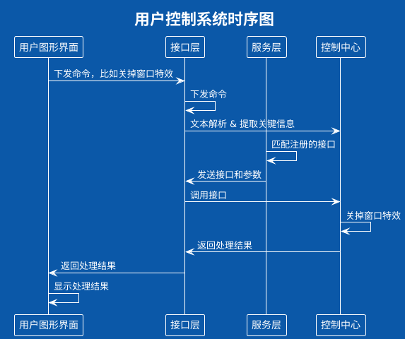
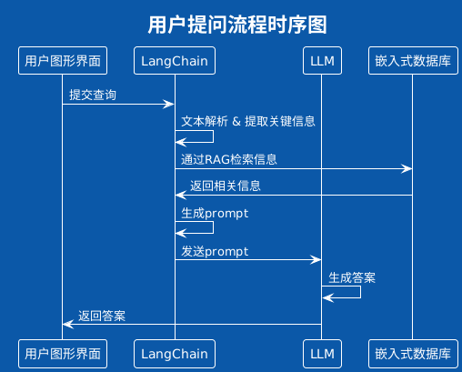

# 概述

## 目的

本概要设计文档旨在为AI助手的开发提供一个全面的技术框架，指导开发团队实现一个高效、智能、安全可靠的企业级AI助手。

本文档特别针对产品经理、设计师、开发人员、测试工程师及后续的系统维护人员编写，旨在作为项目全生命周期中的关键参考文档，促进团队成员之间的有效沟通与协作，确保项目顺利推进。

## 名词解释

- **RAG**: (Retrieval-Augmented Generation)：检索增强生成模型，AI助手能够从本地存储的知识库中检索相关信息，结合上下文生成高质量的回答。
- **NLP**: (Natural Language Processing)：自然语言处理，研究如何让计算机理解和生成人类使用的自然语言的技术。NLP涉及语音识别、语义理解、情感分析等多个方面。
- **Qt**: Qt是一个跨平台的应用程序开发框架，主要用于创建图形用户界面（GUI）。它支持C++编程语言，并提供了丰富的UI组件库和工具，使得开发者能够快速构建高性能的桌面、移动和嵌入式应用程序。
- **Ollama**: Ollama是一个开源项目，旨在提供一个灵活的框架，用于加载和运行各种机器学习模型，特别是那些专注于自然语言处理（NLP）任务的模型。
- **Qwen2**: Qwen2是一个特定的自然语言处理模型，主要用于文本生成和对话系统。
- **LangChain**: LangChain是一个框架，用于构建和运行复杂的自然语言处理流水线。LangChain提供了一系列工具和组件，使得开发者能够轻松地集成不同的NLP模型和服务，构建多功能的语言处理应用。
- **LLM**: (Large Language Model)：如Qwen2，用于文本生成和对话系统。这些模型经过大规模训练，具备强大的语言理解和生成能力。
- **Embedding Model**：用于将文本转化为向量表示，以便于计算相似度或进行其他NLP任务。嵌入模型是实现检索增强生成（RAG）等高级功能的基础。

## 参考资料

- LangChain帮助文档： https://python.langchain.com/v0.1/docs/get_started/introduction/

- Ollama中文网： https://ollama.fan/

- 《AI助手需求分析说明书》：http://172.16.100.110:9090/c/Doc-center/Dev_docs_desktop/+/323

# 系统设计

## 设计原则

在AI助手的设计过程中，我们遵循以下核心原则：
- 用户友好性：确保界面直观易用，操作流畅自然，提供清晰的反馈机制，提升用户体验。
- 编码清晰：保持代码简洁、易于理解和维护，采用统一的编码风格和命名规范。
- 可扩展性与灵活性：设计模块化、松耦合的系统架构，便于未来功能的扩展与定制。
- 高效性与稳定性：优化资源管理，确保I助手在高负载下仍能稳定运行，提供流畅的窗口管理体验。
- 兼容性强：确保AI助手能在多种操作系统和硬件平台上稳定运行。
- 性能优化：关注系统性能，通过合理的资源分配和算法优化，确保I助手高效运行。

## 主要模块设计

### 结构设计


AI助手分为三个大的模块，应用层、接口层和服务层。应用层是面向用户的界面层，包含了多个不同的应用程序，这些应用程序提供了与用户直接交互的功能。在这个层次上，用户可以执行日常操作，如与AI助手互动、管理文件、安装新应用等。接口层提供了操作系统与底层AI服务之间的统一接口，使得上层应用能够透明地访问底层的服务，本文档在这里只讲解AI助手客户端。接口层负责抽象掉底层服务的复杂性，提供简单、一致的API供应用层调用。服务层是AI助手的核心功能所在，包含了实现AI助手各项功能的具体服务。这些服务通常运行在后台，为应用层提供强大的技术支持。
    
### AI助手客户端 (AI-Assistant)

AI助手客户端在系统启动时自动加载至任务栏托盘，点击托盘图标即可展开主界面，内含提问输入框、结果显示框、切换模型按钮及设置功能。设置中涵盖知识库管理、字体大小调整、语言选择与文字颜色自定义等选项，旨在提供便捷且个性化的用户体验。

#### 首页

当用户点击托盘图标选择“显示”选项时，AI助手客户端的主界面将会出现。主界面应该具有以下功能组件：

##### 提问输入框

功能描述：提供一个清晰可见的文本输入区域，用户可以通过键入文字来提问或给出指令。提问输入框还应该支持快捷键操作，便于频繁使用的用户提高效率。

技术实现：使用Qt的QLineEdit组件作为搜索框的基础。为了支持快捷键操作，可以使用QShortcut类来绑定快捷键。提问输入框应设计为一个独立的组件，易于在不同的布局中复用。可以使用信号槽机制与应用逻辑层进行交互，确保用户输入能够及时传递给后端处理。

##### 结果显示框

功能描述：显示AI助手对用户提问的响应。文本输出应当清晰易读，支持基本的富文本格式（例如加粗、斜体、列表等），以便于呈现结构化的信息。此外，还应当允许用户复制文本内容。如果是基于RAG生成的回答，需要显示检索到的相关文档片段。提供查看完整文档的选项。

技术实现：使用Qt的QTextEdit或QTextBrowser作为文本输出组件，支持富文本格式。通过Qt的QAction可以轻松实现复制文本的功能。文本输出组件应设计为可配置的，支持不同的样式设置，如字体大小、颜色等。文本输出应支持实时更新，确保与后端数据同步。使用Qt的QListView来展示查询结果和相关文档片段。通过QAction或信号槽机制实现查看完整文档的功能。查询结果展示应设计为一个可滚动的列表，支持高亮显示查询匹配部分。查看完整文档的逻辑应尽量简化，让用户直接点击即可查看。

##### 切换模型

功能描述：允许用户根据需要选择不同的AI模型，这些模型可以是系统预装的，也可以是用户自行下载并安装的。应当支持一键切换模型的能力。

技术实现：使用Qt的QComboBox作为模型选择器，每个模型项都可以包含简短的描述或标签，帮助用户选择。通过QAction或信号槽机制实现模型切换逻辑。模型切换功能应当设计为一个模块，便于在不同界面中复用。模型的加载与卸载应在后台进行，不影响用户体验。

#### 设置界面

主界面右上角提供设置界面的入口，点击设置弹出设置界面。

##### 基础设置

功能描述：允许用户自定义各种偏好设置，比如界面语言、文本颜色、字体大小、音量调节等。此外，还可以提供高级设置，如响应速度、对话历史记录的保存等。设置选项应当直观易用，并且可以在任何时候访问，以方便用户即时调整。

技术实现：使用Qt的QSettings来存储用户的偏好设置。通过QDialog或QWidget创建设置对话框，使用QSpinBox、QSlider等控件实现数值设置。设置选项应设计为一个易于导航的界面，支持即时应用更改。设置对话框应当具备撤销更改的功能，允许用户取消未保存的更改。

##### 知识库管理（RAG）

功能描述：提供一个功能界面，使用户能够上传自己的数据集或文档，用于训练AI助手，从而让其更好地理解和响应特定领域的问题。用户还可以标记数据的重要性，以便在训练过程中给予更高的权重。知识库应当具备版本控制功能，确保数据的安全性和一致性。

技术实现：使用Qt的QFileDialog组件让用户选择文件上传，使用QTableView或QListView来展示已上传的文档列表。通过QAction或信号槽机制实现文件上传和版本控制逻辑。知识库管理功能应设计为一个独立的窗口或对话框，方便用户操作。文件上传应支持进度条显示，提升用户体验。

#### 语音输入/输出设置

功能描述：支持用户通过语音指令与AI助手交互，包括识别多种语言和方言的能力。还应支持连续语音识别，以提高对话的自然度。将AI助手的回答转换成语音播放给用户，支持多种语言和发音人的选择。语音输出应当提供高质量的声音合成，确保声音自然流畅。还应当提供调节语速和音调的功能，以满足不同用户的听力需求。

技术实现：使用Qt的QAudio类来实现语音输入输出功能。可以集成第三方语音识别/合成服务，如Google Cloud Speech-to-Text API 和 Text-to-Speech API。通过QAction或信号槽机制实现语音输入输出控制。语音输入输出功能应设计为一个独立的模块，便于集成不同的语音服务。语音识别和合成的逻辑应当尽量简化，确保用户能够轻松使用。

此表格列出了`VoiceInputOutput`类中的构造函数及相关方法，以及它们的功能描述。由于这些方法都是初始化或启用功能的方法，并没有直接的参数输入或输出返回值，因此参数说明和返回值说明均为"无"。

### 接口层 (Interface Layer)


接口层是AI助手系统的重要组成部分之一，它位于应用层和服务层之间，起到了桥梁的作用。接口层的主要职责是提供统一的标准接口，使得应用层能够方便地调用服务层的各种功能，并确保API的稳定性和一致性。此外，接口层还负责处理安全相关的功能，如身份验证和权限管理，确保只有授权的应用能够访问特定的服务。下面详细介绍接口层的各个功能模块及其技术实现。

#### 统一调用接口

功能描述：接口层定义了一系列标准化的API，这些API使得应用层能够方便地调用服务层的各种功能。接口层需要确保API的稳定性和一致性，以便于应用层的开发和维护。

技术实现：使用Dbus和RPC机制来提供统一的调用接口。通过Dbus和RPC机制，操作系统中的其他进程可以方便地使用操作系统提供的AI功能，以便开发人员能够轻松地集成和使用这些功能。

#### 适配器

功能描述：接口层包含适配器，这些适配器将应用层的请求转换为服务层所需的格式，同时也将服务层的响应转换为应用层期望的格式。

技术实现：基于LangChain的agent，将用户的命令转换成操作系统的系统调用或者某一个具体的函数

以上表格详细列出了各个适配器类中的公共槽函数（public slots），包括每个函数的作用、输入参数类型以及返回值类型。

#### 安全与认证

功能描述：接口层负责处理安全相关的功能，如身份验证、权限管理和数据加密，确保只有授权的应用才能访问特定的服务。

技术实现：添加鉴权机制或者其他安全验证机制。还可以使用SSL/TLS协议来加密数据传输，确保数据的安全性。

#### 操作系统API调用

功能描述：实现与操作系统进行交互的功能，调用必要的API，以便AI助手能够充分利用操作系统的功能和服务。

技术实现：通过调用操作系统提供的API，如启动应用程序、访问某个网站、设置声音、亮度，修改主题、壁纸等。

### 服务层 (Service Layer)

服务层是AI助手的核心功能所在，包含了实现AI助手各项功能的具体服务。这些服务通常运行在后台，为应用层提供强大的技术支持。确保了AI助手在不同操作系统上的兼容性、安全性、资源效率以及易维护性。每个功能点都采用了成熟的技术实现方案，并且在架构上实现了模块化和解耦，提高了整体系统的可扩展性和健壮性。这样的设计既符合当前的技术背景，也为未来的扩展留下了足够的空间

#### 文本解析

功能描述：实现文本解析功能，能够解析用户的文本输入，提取关键信息，以便AI助手能够正确理解和处理用户的请求。包括词法分析、语法分析以及语义理解等步骤，确保AI助手能够准确地理解用户意图。

技术实现：使用Ollama加载的Qwen2模型来处理文本解析任务。Qwen2模型具备强大的自然语言理解能力，能够对用户输入进行深层次的语义分析。设计一个独立的服务或模块，专门负责文本解析任务。该模块可以独立部署，并通过API与其他组件通信。可以采用异步处理的方式，提高处理效率。

#### 多轮对话管理

功能描述：实现多轮对话管理功能，确保AI助手能够记住之前的对话内容，以便在后续的交互中提供连贯的回答。支持上下文理解，使得AI助手能够在对话的不同阶段之间建立起联系，提高对话的自然度和流畅度。

技术实现：使用LangChain框架中的对话管理组件，结合Qwen2模型的上下文理解能力，实现多轮对话的管理。LangChain提供的对话管理组件可以跟踪对话历史，支持上下文感知。设计一个多轮对话管理服务，该服务能够与文本解析模块无缝衔接，将解析后的信息与对话历史相结合，生成连贯的回答。该服务同样采用微服务架构，便于横向扩展。

#### 查询优化

功能描述：实现查询优化功能，通过对用户的查询进行优化，提高检索效率。包括查询重写、索引选择等技术手段，以确保能够快速、准确地检索到相关信息。

技术实现：利用LangChain框架中的查询优化组件，结合Qwen2模型的自然语言处理能力，对用户的查询进行优化处理。查询优化组件可以自动重写查询，选择最优的索引策略。设计一个查询优化服务，该服务与文本解析模块协同工作，将解析后的查询进行优化处理。查询优化服务应当具备高性能，以支持实时查询。

#### 资源使用监控

功能描述：实现资源使用监控功能，监控CPU、内存等资源使用情况，确保AI助手运行时不会过度占用系统资源。

技术实现：暂无。

#### 错误日志记录

功能描述：实现错误日志记录功能，记录系统错误信息，便于调试和维护。

技术实现：暂无。

#### 数据加密

功能描述：实现数据加密功能，加密存储的数据以保护用户隐私。

技术实现：暂无。

#### 本地数据库

功能描述：实现本地数据库功能，用于存储所有数据和索引信息，以支持离线环境下的查询和检索。

技术实现：使用SQLite、LevelDB等轻量级数据库。可以使用ORM框架如Hibernate或SQLAlchemy来简化数据库操作。设计一个本地数据库服务，该服务负责数据的持久化存储。本地数据库服务应当具备数据备份和恢复能力。

#### 自动更新

功能描述：实现自动更新功能，定期检查并安装软件更新，以保持AI助手的最新状态。

技术实现：暂无。

#### 定期维护

功能描述：实现定期维护功能，执行定期的任务，如清理缓存等，以保持系统的最佳性能。

技术实现：暂无。

### 模型层

#### LLM

AI助手的核心功能依赖于一个大型语言模型——Qwen2，该模型具备强大的自然语言处理能力，能够理解和生成高质量的文本内容。考虑到普通用户的计算机性能可能有限，尤其是在使用国产CPU的情况下，选择了相对较小的1.5B参数规模的Qwen2模型。通过Ollama框架加载此模型，确保在较低性能的硬件上也能高效运行。

Ollama是一个灵活的框架，支持多种机器学习模型的加载和运行。Ollama的设计初衷是为了简化模型部署的过程，使得开发者能够轻松地将训练好的模型集成到实际应用中，Ollama提供了简单的API来加载模型，且支持模型优化，如量化（quantization）、半精度浮点数（FP16）运算等，这些技术可以进一步降低模型的内存占用并提高推理速度。

##### 模型部署与集成

部署方式：将模型部署在本地，即直接在用户的计算机上运行。这种方式可以减少网络延迟，提高响应速度，并且无需依赖外部服务。
集成方式：通过LangChain等框架将加载好的模型集成到应用逻辑中，实现从用户输入到模型推理再到结果输出的完整流程。LangChain提供的组件可以帮助构建复杂的NLP流水线，简化开发过程。


#### 嵌入式向量数据库

嵌入式向量数据库用于将文本转化为向量表示，以便于计算相似度或进行其他自然语言处理（NLP）任务。嵌入模型是实现检索增强生成（RAG）等高级功能的基础。通过将文本数据转换为向量表示，可以高效地进行相似度搜索，从而支持诸如知识库查询、信息检索等功能。

##### 向量数据库的选择与配置：

选择向量数据库：选择一个适合嵌入式环境的向量数据库，如Faiss、Annoy、Hnswlib等。这些数据库支持高效的向量相似度搜索，且可以在本地运行。

配置向量数据库：使用Ollama框架来加载和配置选定的向量数据库。Ollama提供了接口来管理向量数据库，包括初始化、插入数据和查询等操作。

##### 文本到向量的转换：

嵌入模型：使用一个预先训练好的嵌入模型，如BERT、Sentence Transformer等，将文本数据转换为向量表示。这些模型能够捕捉文本的语义信息，并生成高质量的向量表示。

向量生成：将文本输入到嵌入模型中，生成对应的向量表示。这些向量可以存储在向量数据库中，用于后续的相似度搜索。

##### 向量数据的插入：

数据预处理：对原始文本数据进行清洗和预处理，去除噪声数据，确保数据的质量。

批量插入：将预处理后的文本数据通过嵌入模型转换为向量表示，然后批量插入到向量数据库中。可以使用Ollama提供的API来实现这一过程。

索引构建：在数据插入完成后，构建索引以提高后续查询的速度。索引构建是向量数据库的一项重要功能，能够显著提升查询性能。

##### 向量数据的读取与查询：

查询构造：当用户输入查询时，使用相同的嵌入模型将查询文本转换为向量表示。

相似度搜索：使用LangChain的chain将查询流程连接起来，通过向量数据库进行相似度搜索，找到与查询向量最接近的数据。

结果处理：从向量数据库中获取相似度最高的向量数据，并将其转换回原始文本格式，以便于进一步处理和展示给用户。

##### 查询流程的集成：

LangChain集成：使用LangChain框架中的chain组件来集成查询流程。chain组件可以定义一个处理流程，包括数据预处理、向量生成、相似度搜索等步骤。

查询优化：通过LangChain提供的工具，对查询流程进行优化，确保查询速度快且结果准确。

## 关键流程设计



用户通过图形界面发起的一个控制系统功能（例如关闭窗口特效）的过程:

1. 用户在用户图形界面（UserGUI）上输入 关闭窗口特效;
2. 用户图形界面将这个命令发送给接口层（interface）;
3. 接口层接收到命令后，对其进行内部处理，包括数据验证和格式化，并将其转发给服务层;
4. 服务层接收到命令后，开始查找与该命令相匹配的注册接口，并准备必要的参数;
5. 服务层找到合适的接口及参数后，将其返回给接口层;
6. 接口层使用服务层返回的接口和参数调用控制中心（control），以执行具体的命令;
7. 控制中心接收到接口调用请求后，执行具体的命令，例如关闭窗口特效
8. 控制中心完成命令执行后，将处理结果返回给接口层;
9. 接口层将控制中心返回的结果再次转发给用户图形界面;
10. 用户图形界面接收到处理结果后，显示给用户，表明命令已被正确执行;



用户通过图形界面发起的一个提问的过程:

1. 用户提交查询：用户在用户图形界面上输入查询内容，并点击提交按钮。
2. LangChain处理查询：用户图形界面将查询发送给LangChain，后者对查询进行文本解析和提取关键信息。
3. 通过RAG检索信息：LangChain利用提取的关键信息，在嵌入式数据库中进行搜索，获取相关信息。
4. 生成prompt：LangChain根据检索到的信息生成prompt，以便于LLM理解并生成答案。
5. 发送prompt：LangChain将生成的prompt发送给LLM。
6. LLM生成答案：LLM接收到prompt后，生成回答。
7. 返回答案：LLM将生成的答案返回给LangChain。
8. LangChain返回答案：LangChain接收到答案后，将其返回给用户图形界面。
9. 用户图形界面显示答案：最后，用户图形界面将答案呈现给用户。


## 关键数据结构设计

### 初始化自定义prompt时的内容

```
尽可能好地回答以下问题，你有以下工具可用:
Search: 有助于回答有关当前事件的问题
set volumn: 设置声音的高低
set net status: 设置网络状态
以后的所有回答，都使用以下格式回复:
Question: 你必须回答的输入问题
Action: 要采取的行动，应该是以下之一 [Search, set_volumn, set_net_status]
Action Input: 行动的输入
Observation: 行动的结果
Thought: 最终的答案
开始吧。
Question: 设置声音
```

### 向LLM绑定自定义函数时的格式
```
{
    "name": "set_volumn",
    "description": "设置声音大小",
    "parameters": {
        "type": "object",
        "properties": {
            "volumn": {
                "type": "int",
                "description": "音量大小,从0到100 " "例如： 87",
            }
        },
        "required": ["location"],
    },
},
{
    "name": "set_net_status",
    "description": "设置网络开关",
    "parameters": {
        "type": "object",
        "properties": {
            "status": {
                "type": "string",
                "description": "网络状态,True或False " "例如： \"False\"",
            }
        },
        "required": ["status"],
    },
}
```
### LLM匹配到函数时，返回的json

```
additional_kwargs={'function_call': 
{'name': 'set_volumn', 'arguments': '{"volumn": 10}'}
 id='run-3f4226e6-6737-4962-85ea-2182a4e66c63-0
```


## 主要人机交互设计


# 非功能性设计

## 性能

使用较小规模的Qwen2模型（1.5B参数），并通过Ollama框架的量化技术进一步减少内存占用。

接口层服务使用多线程技术，提高并发处理能力，确保多任务环境下依然保持高效。

服务层的AI服务部署在Docker中，可以精确地控制每个容器所使用的资源（如 CPU、内存），确保应用在不同环境下都能获得稳定的性能表现。

## 安全性

添加鉴权机制或者其他安全验证机制，保证只有经过认证的用户才能访问系统功能。

Docker 容器提供了一个安全的隔离环境，可以限制容器内的应用访问主机系统的权限，从而提高安全性

## 可靠性

Docker 容器可以配置自动重启策略，确保容器在出现故障时能够自动恢复。

## 易用性

设计简洁、直观的用户界面，减少用户的认知负担。

通过 Docker Compose 或 Kubernetes 部署文件，可以实现一键部署整个应用栈，简化部署流程。

通过 Docker Hub 发布镜像，并附带详细的文档和版本标签，方便用户查找和使用。

## 兼容性

使用跨平台的Qt，确保AI助手能够在等不同硬件架构上运行。

设计稳定的API接口，确保未来版本更新时，现有应用能够继续使用而无需大幅修改。

Docker 支持多平台镜像可以在不同硬件架构（如 x86、ARM）上运行相同的镜像。