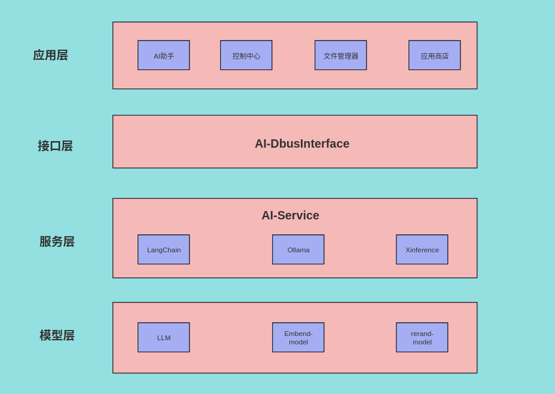
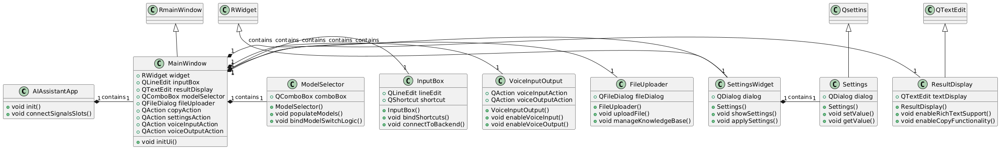
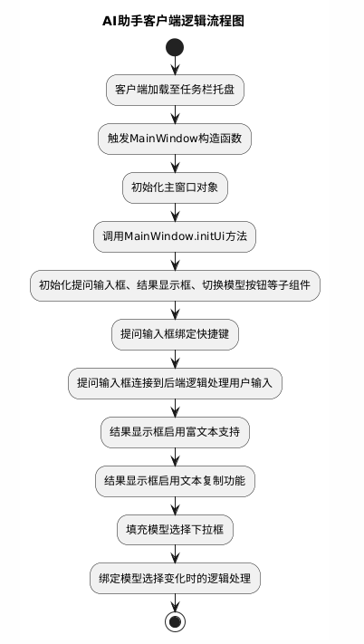
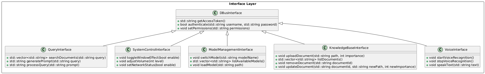
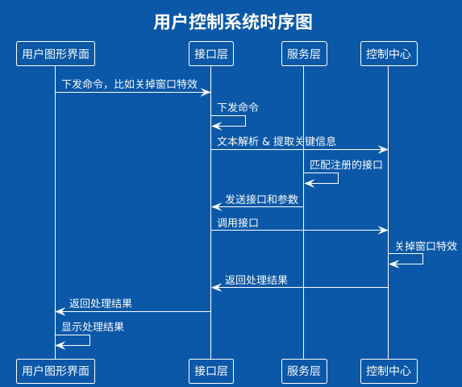
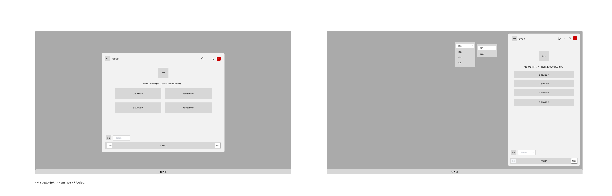

# 概述

## 目的

本详细设计文档旨在为AI助手的开发提供一个全面的技术框架，指导开发团队实现一个高效、智能、安全可靠的企业级AI助手。

本文档特别针对产品经理、设计师、开发人员、测试工程师及后续的系统维护人员编写，旨在作为项目全生命周期中的关键参考文档，促进团队成员之间的有效沟通与协作，确保项目顺利推进。

## 术语说明

- **RAG**: (Retrieval-Augmented Generation)：检索增强生成模型，AI助手能够从本地存储的知识库中检索相关信息，结合上下文生成高质量的回答。
- **NLP**: (Natural Language Processing)：自然语言处理，研究如何让计算机理解和生成人类使用的自然语言的技术。NLP涉及语音识别、语义理解、情感分析等多个方面。
- **Qt**: Qt是一个跨平台的应用程序开发框架，主要用于创建图形用户界面（GUI）。它支持C++编程语言，并提供了丰富的UI组件库和工具，使得开发者能够快速构建高性能的桌面、移动和嵌入式应用程序。
- **Ollama**: Ollama是一个开源项目，旨在提供一个灵活的框架，用于加载和运行各种机器学习模型，特别是那些专注于自然语言处理（NLP）任务的模型。
- **Qwen2**: Qwen2是一个特定的自然语言处理模型，主要用于文本生成和对话系统。
- **LangChain**: LangChain是一个框架，用于构建和运行复杂的自然语言处理流水线。LangChain提供了一系列工具和组件，使得开发者能够轻松地集成不同的NLP模型和服务，构建多功能的语言处理应用。
- **LLM**: (Large Language Model)：如Qwen2，用于文本生成和对话系统。这些模型经过大规模训练，具备强大的语言理解和生成能力。
- **Embedding Model**：用于将文本转化为向量表示，以便于计算相似度或进行其他NLP任务。嵌入模型是实现检索增强生成（RAG）等高级功能的基础。

## 参考资料

- LangChain帮助文档： https://python.langchain.com/v0.1/docs/get_started/introduction/

- Ollama中文网： https://ollama.fan/

- 《AI助手需求分析说明书》：http://172.16.100.110:9090/c/Doc-center/Dev_docs_desktop/+/323

# 模块设计

## 设计约束

在AI助手的设计过程中，我们遵循以下核心原则：
- 用户友好性：确保界面直观易用，操作流畅自然，提供清晰的反馈机制，提升用户体验。
- 编码清晰：保持代码简洁、易于理解和维护，采用统一的编码风格和命名规范。
- 可扩展性与灵活性：设计模块化、松耦合的系统架构，便于未来功能的扩展与定制。
- 高效性与稳定性：优化资源管理，确保I助手在高负载下仍能稳定运行，提供流畅的窗口管理体验。
- 兼容性强：确保AI助手能在多种操作系统和硬件平台上稳定运行。
- 性能优化：关注系统性能，通过合理的资源分配和算法优化，确保I助手高效运行。

## 主要模块设计

### 结构设计



AI助手分为三个大的模块，应用层、接口层和服务层。应用层是面向用户的界面层，包含了多个不同的应用程序，这些应用程序提供了与用户直接交互的功能。在这个层次上，用户可以执行日常操作，如与AI助手互动、管理文件、安装新应用等。接口层提供了操作系统与底层AI服务之间的统一接口，使得上层应用能够透明地访问底层的服务，本文档在这里只讲解AI助手客户端。接口层负责抽象掉底层服务的复杂性，提供简单、一致的API供应用层调用。服务层是AI助手的核心功能所在，包含了实现AI助手各项功能的具体服务。这些服务通常运行在后台，为应用层提供强大的技术支持。
    
### AI助手客户端 模块设计

### 总体设计



AI助手客户端在系统启动时自动加载至任务栏托盘，点击托盘图标即可展开主界面，内含提问输入框、结果显示框、切换模型按钮及设置功能。设置中涵盖知识库管理、字体大小调整、语言选择与文字颜色自定义等选项，旨在提供便捷且个性化的用户体验。

### 主要接口

| 接口名 | 参数说明 | 返回值说明 | 接口说明 |
| --- | --- | --- | --- |
| MainWindow.MainWindow | 应用实例(app: AIAssistantApp) | 无 | 构造函数，初始化主窗口，并调用UI初始化方法 |
| MainWindow.initUi | 无 | 无 | 初始化主窗口的用户界面，创建并设置中央部件，初始化子组件 |
| InputBox.bindShortcuts | 无 | 无 | 绑定快捷键到相应的操作 |
| InputBox.connectToBackend | 无 | 无 | 连接到后端逻辑以处理输入事件 |
| ResultDisplay.enableRichTextSupport | 无 | 无 | 启用富文本支持功能 |
| ResultDisplay.enableCopyFunctionality | 无 | 无 | 启用文本复制功能 |
| ModelSelector.populateModels | 无 | 无 | 填充模型选择下拉框中的模型选项 |
| ModelSelector.bindModelSwitchLogic | 无 | 无 | 绑定模型选择变化时的逻辑处理 |
| SettingsWidget.showSettings | 无 | 无 | 显示设置对话框 |
| SettingsWidget.applySettings | 无 | 无 | 应用当前设置 |
| KnowledgeBaseManager.connectUploadSignalSlot | 无 | 无 | 连接上传文件的操作与对应的处理函数 |
| KnowledgeBaseManager.connectMarkImportanceSignalSlot | 无 | 无 | 连接标记文件重要性的操作与对应的处理函数 |
| KnowledgeBaseManager.connectVersionControlSignalSlot | 无 | 无 | 连接版本控制的操作与对应的处理函数 |
| KnowledgeBaseManager.onUpload | 无 | 无 | 处理用户上传文件的逻辑 |
| KnowledgeBaseManager.onMarkImportance | 无 | 无 | 处理用户标记文件重要性的逻辑 |
| KnowledgeBaseManager.onVersionControl | 无 | 无 | 处理用户进行版本控制的逻辑 |
| VoiceInputOutput.VoiceInputOutput | 主窗口(MainWindow window) | 无 | 构造函数，初始化语音输入和输出动作 |
| VoiceInputOutput.enableVoiceInput | 无 | 无 | 启用语音输入功能 |
| VoiceInputOutput.enableVoiceOutput | 无 | 无 | 启用语音输出功能 |

### 逻辑流程


### 错误处理
为了更好地使用AI助手客户端，我们需要考虑在不同阶段可能出现的各种异常情况以及如何应对这些异常：

#### 初始化阶段的错误处理

- **加载失败**：如果客户端加载至任务栏托盘时遇到问题（如权限不足），应捕获异常并在日志中记录。
- **UI初始化错误**：如果`MainWindow.initUi`方法中初始化用户界面组件时出现错误（如样式表加载失败），应当记录异常，并提供用户反馈。
- **组件初始化失败**：在初始化提问输入框、结果显示框等组件时可能会遇到错误（如依赖库未加载），应捕捉异常，并记录日志或通知用户。
- **绑定失败**：在绑定快捷键、信号槽时，如果出现错误（如信号或槽不存在），应该捕获异常，并给出相应的错误信息。

#### 用户交互阶段的错误处理

- **输入验证**：在用户输入问题或指令前，应该对输入进行验证，如果输入不符合预期格式，应提示用户重新输入。
- **后端请求失败**：当后端无法处理请求时（如网络问题、服务器错误），客户端应该能够捕捉到这类异常，并向用户提供友好的错误信息。
- **响应解析错误**：从后端接收到的数据如果不符合预期格式，解析数据时可能会发生错误，应该捕捉此类异常，并记录详细的错误信息以便调试。

#### 其他功能错误处理

- **设置应用错误**：在用户调整设置时，如果应用设置失败（如写入配置文件失败），应该记录错误，并提供恢复默认设置的选项。
- **文件上传失败**：在上传文件时，如果遇到问题（如文件过大、格式不支持），应捕捉异常，并向用户提供明确的错误信息。
- **版本控制错误**：在进行版本控制操作时，如果出现问题（如存储空间不足），也应该捕捉异常，并记录日志。

#### 错误处理策略

对于上述提到的错误，可以采取以下策略：

- **日志记录**：记录错误详细信息，包括时间戳、错误类型、堆栈跟踪等。
- **用户反馈**：对于可以预见的错误，向用户提供清晰的错误信息和建议。
- **重试机制**：对于网络请求等可恢复的错误，可以实现重试机制。
- **容错处理**：确保程序即使在部分功能失效的情况下也能继续运行其他功能。
- **崩溃报告**：对于导致程序崩溃的严重错误，应该收集崩溃报告，并尝试自动发送给开发团队。

通过这样的错误处理流程，可以确保AI助手客户端在面对各种异常情况时仍然能够稳定运行，并为用户提供良好的使用体验。

### 接口层 模块设计

### 总体设计



### 主要接口

#### 大模型接口

| 接口名 | 参数说明 | 返回值说明 | 接口说明 |
| :------------------------------------: | :-----------------------------------------: | :-----------------------------------: | :--------------------: |
BaseDBusInterface.getAccessToken |	无 |	返回字符串类型的访问令牌 |	获取访问令牌 
BaseDBusInterface.authenticate |	用户名(username)，密码(password) |	返回布尔值，表示认证是否成功 |	用户认证 
BaseDBusInterface.setPermissions |	权限字符串(permissions) |	无 |	设置权限 |
QueryInterface.searchDocuments |	查询字符串(query)	| 返回字符串列表，包含查询结果	| 搜索文档
QueryInterface.generatePrompt |	查询字符串(query) |	返回字符串类型的提示	| 生成提示
QueryInterface.processQuery |	提示(prompt) |	返回字符串类型的处理结果 |	处理查询
ModelManagementInterface.switchModel |	模型名称(modelName) |	无	| 切换模型
ModelManagementInterface.listAvailableModels |	无 |	返回字符串列表，包含可用模型名称	| 列出所有可用模型
ModelManagementInterface.loadModel |	模型路径(path) |	无 |	加载模型
KnowledgeBaseInterface.uploadDocument |	文件路径(path)，重要性(importance) |	无 |	上传文档到知识库
KnowledgeBaseInterface.listDocuments |	无 |	返回字符串列表，包含文档标识符 |	列出知识库中的文档
KnowledgeBaseInterface.removeDocument |	文档标识符(documentId) |	无 |	移除知识库中的文档
KnowledgeBaseInterface.updateDocument |	文档标识符(documentId)，新的文件路径(newPath)，新的重要性(newImportance) |	无 |	更新知识库中的文档

#### 适配器接口

| 接口名 | 参数说明 | 返回值说明 | 接口说明 |
| --- | --- | --- | --- |
| QueryAdaptor.searchDocuments | 查询字符串(query) | 字符串列表(QList<QString>) | 根据查询字符串搜索文档并返回结果列表 |
| QueryAdaptor.generatePrompt | 查询字符串(query) | 字符串(QString) | 生成一个基于查询字符串的提示 |
| QueryAdaptor.processQuery | 提示(prompt) | 字符串(QString) | 处理给定的提示并返回结果 |
| SystemControlAdaptor.toggleWindowEffect | 是否启用(enable: bool) | 无 | 切换窗口效果的开启或关闭 |
| SystemControlAdaptor.adjustVolume | 音量级别(level: int) | 无 | 调整音量至指定级别 |
| SystemControlAdaptor.setNetworkStatus | 是否启用(enable: bool) | 无 | 设置网络状态为开启或关闭 |
| ModelManagementAdaptor.switchModel | 模型名称(modelName: QString) | 无 | 切换到指定的模型 |
| ModelManagementAdaptor.listAvailableModels | 无 | 字符串列表(QList<QString>) | 列出所有可用的模型名称 |
| ModelManagementAdaptor.loadModel | 模型路径(path: QString) | 无 | 加载指定路径下的模型 |


#### 操作系统API调用

| 接口名 | 参数说明 | 返回值说明 | 接口说明 |
| --- | --- | --- | --- |
| SystemControlInterface.toggleWindowEffect | 是否启用(enable: bool) | 无 | 切换窗口特效的开启或关闭 |
| SystemControlInterface.adjustVolume | 音量级别(level: int) | 无 | 调整系统音量至指定级别 |
| SystemControlInterface.setNetworkStatus | 是否启用(enable: bool) | 无 | 设置网络连接的状态，开启或关闭 |

### 逻辑流程



### 错误处理

接口层作为应用层和服务层之间的桥梁，需要能够有效地处理来自两方面的错误，并提供适当的反馈或恢复机制。以下是一些可能的错误场景及其处理方式：

#### 认证与权限管理错误处理

- **认证失败**：当`BaseDBusInterface.authenticate`认证失败时，应该记录错误信息，并向应用层返回认证失败的通知。
- **权限设置错误**：当`BaseDBusInterface.setPermissions`设置权限时遇到问题，如无效的权限字符串，应该记录错误，并返回错误信息给应用层。

#### 生成与处理查询错误处理

- **生成提示失败**：当`QueryInterface.generatePrompt`无法生成提示时，可能是由于输入不符合要求，此时应返回错误信息。
- **处理查询失败**：如果`QueryInterface.processQuery`在处理查询时遇到问题，如内部逻辑错误，应记录错误，并返回错误信息。

#### 模型管理错误处理

- **模型切换失败**：当`ModelManagementInterface.switchModel`无法切换模型时，可能是目标模型不存在，应返回错误信息。
- **列出模型失败**：当`ModelManagementInterface.listAvailableModels`无法列出所有可用模型时，可能是由于读取目录失败或其他原因，应记录错误，并返回错误信息。

#### 知识库管理错误处理

- **上传文档失败**：当`KnowledgeBaseInterface.uploadDocument`上传文档失败时，可能是由于文件格式不支持或磁盘空间不足等原因，应返回错误信息。
- **移除文档失败**：当`KnowledgeBaseInterface.removeDocument`移除文档失败时，可能是由于文件不存在或权限问题，应记录错误，并返回错误信息。

## 全局数据结构设计

### 初始化自定义prompt时的内容

```
尽可能好地回答以下问题，你有以下工具可用:
Search: 有助于回答有关当前事件的问题
set volumn: 设置声音的高低
set net status: 设置网络状态
以后的所有回答，都使用以下格式回复:
Question: 你必须回答的输入问题
Action: 要采取的行动，应该是以下之一 [Search, set_volumn, set_net_status]
Action Input: 行动的输入
Observation: 行动的结果
Thought: 最终的答案
开始吧。
Question: 设置声音
```

### 向LLM绑定自定义函数时的格式
```
{
    "name": "set_volumn",
    "description": "设置声音大小",
    "parameters": {
        "type": "object",
        "properties": {
            "volumn": {
                "type": "int",
                "description": "音量大小,从0到100 " "例如： 87",
            }
        },
        "required": ["location"],
    },
},
{
    "name": "set_net_status",
    "description": "设置网络开关",
    "parameters": {
        "type": "object",
        "properties": {
            "status": {
                "type": "string",
                "description": "网络状态,True或False " "例如： \"False\"",
            }
        },
        "required": ["status"],
    },
}
```
### LLM匹配到函数时，返回的json

```
additional_kwargs={'function_call': 
{'name': 'set_volumn', 'arguments': '{"volumn": 10}'}
 id='run-3f4226e6-6737-4962-85ea-2182a4e66c63-0
```

# 安全风险分析

提供访问控制功能，确保只有经过授权的用户才能访问特定的数据和功能。包括用户身份验证、权限管理等机制，以保护用户的隐私和数据安全。

提供数据加密功能，加密存储的数据以保护用户隐私。包括对敏感信息进行加密处理，确保即使数据被非法访问也不会泄露用户隐私。

## 主要人机交互设计



# 非功能性设计

## 性能

使用较小规模的Qwen2模型（1.5B参数），并通过Ollama框架的量化技术进一步减少内存占用。

接口层服务使用多线程技术，提高并发处理能力，确保多任务环境下依然保持高效。

服务层的AI服务部署在Docker中，可以精确地控制每个容器所使用的资源（如 CPU、内存），确保应用在不同环境下都能获得稳定的性能表现。

## 安全性

添加鉴权机制或者其他安全验证机制，保证只有经过认证的用户才能访问系统功能。

Docker 容器提供了一个安全的隔离环境，可以限制容器内的应用访问主机系统的权限，从而提高安全性

## 可靠性

Docker 容器可以配置自动重启策略，确保容器在出现故障时能够自动恢复。

## 易用性

设计简洁、直观的用户界面，减少用户的认知负担。

通过 Docker Compose 或 Kubernetes 部署文件，可以实现一键部署整个应用栈，简化部署流程。

通过 Docker Hub 发布镜像，并附带详细的文档和版本标签，方便用户查找和使用。

## 兼容性

使用跨平台的Qt，确保AI助手能够在等不同硬件架构上运行。

设计稳定的API接口，确保未来版本更新时，现有应用能够继续使用而无需大幅修改。

Docker 支持多平台镜像可以在不同硬件架构（如 x86、ARM）上运行相同的镜像。


# 部署方案

（说明部署方案）

## 硬件要求

- **处理器**：支持x86_64和ARM架构等现代处理器。
- **内存**：至少8GB内存，推荐16GB以上以确保流畅运行。
- **存储**：至少50GB的可用存储空间，用于安装和日志存储。
- **图形处理器**：推荐使用目前市场上最新的顶配显卡。

## 软件要求

- **Qt 5.15+**：用于用户界面开发。
- **OpenGL 3.3+**：用于图形渲染。
- **CMake 3.10+**：用于构建管理。
- **Python 3.7+**：用于运行大模型以及其他框架。

# 附录

无