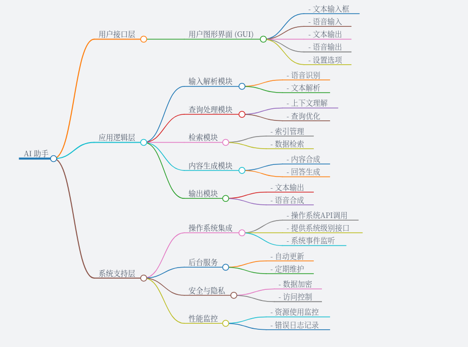

# 引言

## 背景介绍

随着人工智能技术的迅速发展以及企业数字化转型的需求日益增长，开发一款高效、智能的企业级AI助手成为当务之急。

AI助手旨在为企业提供智能化的服务和支持，帮助提升工作效率、优化业务流程、增强客户体验，并最终推动企业的可持续发展。

## 产品概述

本项目旨在开发一款高性能、高可用性且安全可靠的离线AI助手，集成于操作系统中，以提高用户的使用效率及体验。该AI助手将充分利用先进的自然语言处理（NLP）技术和机器学习算法，为用户提供智能、便捷的支持和服务。

该AI助手将作为一个内置组件集成到操作系统中，主要面向需要快速访问信息、执行操作以及获取技术支持的个人用户和企业用户。它能够在无互联网连接的情况下提供服务，特别适合那些对隐私保护有着严格要求或者网络条件受限的场景。

## 价值主张

- 提高效率：通过减少查找信息和执行常规任务所需的时间，显著提高用户的工作效率。

- 增强安全性：由于所有数据处理均在本地完成，因此减少了数据泄露的风险。

- 提升用户体验：提供友好且人性化的交互方式，使用户能够更加轻松地与操作系统交互。

- 降低成本：对于企业而言，减少对外部支持服务的依赖，从而降低运营成本。

## 名词解释

- **RAG (Retrieval-Augmented Generation)**：利用检索增强生成模型，AI助手能够从本地存储的知识库中检索相关信息，结合上下文生成高质量的回答。

- **NLP (Natural Language Processing)**：自然语言处理，研究如何让计算机理解和生成人类使用的自然语言的技术。NLP涉及语音识别、语义理解、情感分析等多个方面。

# 产品结构图

# 功能需求说明

## 用户图形界面 (User GUI)

| **子功能**   | **描述** | **优先级（必须/应该/可以）**   |
|----------|------------------------------------------------------------------|----------|
| 搜索框   | 提供文本输入方式，用于用户提问   | 必须 |
| 文本输出 | 显示AI助手生成的文字回答 | 必须 |
| 切换模型 | 允许用户修改模型，模型可以是自行下载的，也可以是咱们系统预装的   | 应该 |
| 知识库   | 提供知识库功能，用户可以自行添加一些用来训练的离线的嵌入式知识库 | 应该 |
| 设置选项 | 允许用户调整偏好设置，如语言、音量等 | 应该 |
| 语音输入 | 支持语音指令输入 | 可以 |
| 语音输出 | 将AI助手的回答转换成语音播放 | 可以 |

### 搜索框 

提供一个清晰可见的文本输入区域，用户可以通过键入文字来提问或给出指令。

它还应该支持快捷键操作，便于频繁使用的用户提高效率。

优先级：必须

### 文本输出 

显示AI助手对用户提问的响应，文本输出应当清晰易读，

支持基本的富文本格式（例如加粗、斜体、列表等），以便于呈现结构化的信息。

此外，还应当允许用户复制文本内容。

优先级：必须

### 切换模型 

允许用户根据需要选择不同的AI模型，这些模型可以是系统预装的，也可以是用户自行下载并安装的。

应当支持一键切换模型的能力。

优先级：应该

### 知识库管理（RAG） 

提供一个功能，使用户能够上传自己的数据集或文档，用于训练AI助手，从而让其更好地理解和响应特定领域的问题。

用户还可以标记数据的重要性，以便在训练过程中给予更高的权重。

知识库应当具备版本控制功能，确保数据的安全性和一致性。

优先级：应该

### RAG查询结果展示

显示AI助手基于RAG生成的回答，以及检索到的相关文档片段。

提供查看完整文档的选项。

优先级：必须

### 设置选项 

允许用户自定义各种偏好设置，比如界面语言、文本颜色、字体大小、音量调节等。

此外，还可以提供高级设置，如响应速度、对话历史记录的保存等。

设置选项应当直观易用，并且可以在任何时候访问，以方便用户即时调整。

优先级：应该

### 语音输入 

支持用户通过语音指令与AI助手交互，包括识别多种语言和方言的能力。

还应支持连续语音识别，以提高对话的自然度。

优先级：可以

### 语音输出 

将AI助手的回答转换成语音播放给用户，支持多种语言和发音人的选择。

语音输出应当提供高质量的声音合成，确保声音自然流畅。

还应当提供调节语速和音调的功能，以满足不同用户的听力需求。

优先级：可以

## 应用逻辑层 (Application Logic Layer)

| **子功能** | **描述** | **优先级（必须/应该/可以）**   |
|------------|------------------------------------------------------------------|----------|
| 文本解析   | 解析用户的文本输入，提取关键信息 | 必须 |
| 多轮对话管理 | 记住之前的对话内容，以便在后续的交互中提供连贯的回答   | 必须 |
| 文本输出   | 显示最终的回答内容   | 必须 |
| 查询优化   | 对用户的查询进行优化，提高检索效率   | 应该 |
| 语音识别   | 将用户的语音输入转换为文本   | 可以 |
| 语音合成   | 将最终的回答内容转换为语音   | 可以 |

 ### 文本解析 

实现文本解析功能，能够解析用户的文本输入，提取关键信息，以便AI助手能够正确理解和处理用户的请求。

包括词法分析、语法分析以及语义理解等步骤，确保AI助手能够准确地理解用户意图。

优先级：必须

### 多轮对话管理 

实现多轮对话管理功能，确保AI助手能够记住之前的对话内容，以便在后续的交互中提供连贯的回答。

支持上下文理解，使得AI助手能够在对话的不同阶段之间建立起联系，提高对话的自然度和流畅度。

优先级：必须

### 文本输出 

实现文本输出功能，用于显示最终的回答内容，确保用户能够清楚地看到AI助手的回复。

输出的内容应当清晰、准确，支持基本的富文本格式，如加粗、斜体等，以提高可读性。

优先级：必须

### 查询优化 

实现查询优化功能，通过对用户的查询进行优化，提高检索效率。

包括查询重写、索引选择等技术手段，以确保能够快速、准确地检索到相关信息。

优先级：应该

### 语音识别 

实现语音识别功能，能够将用户的语音输入转换为文本，以便AI助手能够处理。

支持多种语言和方言，具备良好的噪音过滤功能，以确保在嘈杂环境中也能准确识别用户的指令。

优先级：可以

### 语音合成 

实现语音合成功能，将最终的回答内容转换为语音播放给用户。

提供高质量的声音合成，确保声音自然流畅，支持多种语言和发音人的选择。

优先级：可以

## 系统支持层 (System Support Layer)
| **子功能** | **描述** | **优先级（必须/应该/可以）**   |
|--------------|--------------------------------------------------------------|---------|
| 操作系统API调用 | 与操作系统进行交互，调用必要的API | 必须|
| 提供系统级别接口 | 提供系统界别的接口，供操作系统其他部分使用AI相关的功能   | 必须|
| 系统事件监听   | 监听系统事件，如开机、关机等   | 必须|
| 访问控制   | 控制谁可以访问哪些数据 | 必须|
| 资源使用监控   | 监控CPU、内存等资源使用情况| 必须|
| 错误日志记录   | 记录系统错误信息，便于调试和维护   | 必须|
| 数据加密   | 加密存储的数据以保护用户隐私   | 必须|
| 本地数据库 | 存储所有数据和索引信息 | 应该|
| 自动更新   | 定期检查并安装软件更新 | 应该|
| 定期维护   | 执行定期的任务，如清理缓存等   | 可以|

### 操作系统API调用

实现与操作系统进行交互的功能，调用必要的API，以便AI助手能够充分利用操作系统的功能和服务。

这包括但不限于启动应用程序、访问系统设置等。

优先级：必须

### 提供系统级别接口

实现提供系统级别的接口功能，以便操作系统其他部分可以调用AI助手的相关功能。

这些接口应当清晰定义，并提供详细的文档，以便其他开发人员能够轻松地集成和使用这些功能。

接口应当覆盖AI助手的核心功能，如查询处理、内容生成等。

优先级：必须

### 系统事件监听

实现监听系统事件的功能，如开机、关机等，以便AI助手能够在适当的时候启动或关闭。

这有助于确保AI助手始终处于准备状态，同时节省资源。

优先级：必须

### RAG检索能力

AI助手应具备从本地数据库检索相关文档的能力。

在接收到用户的查询后，AI助手首先从本地数据集中检索最相关的内容片段。

根据检索到的内容片段生成prompt，发给AI模型。

优先级：必须

### 访问控制

实现访问控制功能，确保只有经过授权的用户才能访问特定的数据和功能。

包括用户身份验证、权限管理等机制，以保护用户的隐私和数据安全。

优先级：必须

### 资源使用监控

实现资源使用监控功能，监控CPU、内存等资源使用情况，确保AI助手运行时不会过度占用系统资源。

这有助于保持系统的稳定性和响应速度。

优先级：必须

### 错误日志记录

实现错误日志记录功能，记录系统错误信息，便于调试和维护。

日志应当包含详细的错误描述和上下文信息，以便开发者能够快速定位问题。

优先级：必须

### 数据加密

实现数据加密功能，加密存储的数据以保护用户隐私。

包括对敏感信息进行加密处理，确保即使数据被非法访问也不会泄露用户隐私。

优先级：必须

### 本地数据库

实现本地数据库功能，用于存储所有数据和索引信息，以支持离线环境下的查询和检索。

包括管理和维护数据库的工具，确保数据的一致性和完整性。

优先级：应该

### 自动更新

实现自动更新功能，定期检查并安装软件更新，以保持AI助手的最新状态。

更新过程应当尽可能自动化，减少用户的参与程度。

优先级：应该

### 定期维护

实现定期维护功能，执行定期的任务，如清理缓存等，以保持系统的最佳性能。

包括定期清理过期数据、优化数据库等任务。

优先级：可以

# 非功能性需求说明

## 性能需求

- 响应时间：AI助手在收到用户的查询后，应在指定的时间内给出响应，例如在2秒内完成搜索和生成答案的过程。
- 资源利用率：AI助手在运行过程中应合理利用系统的CPU、内存等资源，避免占用过多资源影响用户体验。
- 并发处理能力：AI助手需要支持多用户同时使用，确保在高并发请求下依然能够稳定运行。

## 稳定性需求

- 故障恢复：当发生硬件或软件故障时，AI助手能够快速恢复服务，减少停机时间。
- 数据备份与恢复：定期备份数据并提供数据恢复机制，以防数据丢失。
- 容错能力：设计具有冗余和容错机制的系统架构，确保即使部分组件失效，系统仍然能够正常运行。

## 安全隐私

- 数据加密：对存储的数据进行加密处理，保证敏感信息的安全。
- 权限控制：实现细粒度的权限管理，确保只有授权用户才能访问特定功能或数据。
- 安全审计：记录关键操作的日志，以便进行安全审计和问题追踪。

## 兼容性需求

- 操作系统兼容性：确保AI助手能够在不同的操作系统版本上稳定运行。
- 硬件兼容性：支持多种硬件配置，确保AI助手能够在不同类型的设备上运行。

## 扩展性需求

- 模块化设计：采用模块化的设计方案，便于添加新功能或升级现有功能。
- 水平扩展：支持通过增加更多的服务器来提高处理能力和服务质量。

## 多语言

- 系统应支持多语言环境，以满足不同语言用户的需求，提升用户体验。

# 项目风险

## 关键风险

- 技术风险：AI相关技术栈比较深奥，且相关的开源项目大多使用python开发，需要更多的时间去学习。
- 硬件支持：大模型相关的训练包括RAG的训练，都需要一个强大的显卡，咱们目前还不具备。
- 资源限制：AI助手需要在设备上运行，而设备可能没有足够的内存、处理器速度或存储空间来处理复杂的AI任务。这意味着我们需要选择合适的AI模型，使其既能满足功能需求，又能适合设备的硬件条件。
- 模型大小：AI模型往往很大，占用大量空间。我们需要找到方法来减小模型的大小，比如通过模型剪枝或量化，以便它可以存储在设备上而不占用太多空间。
- 数据更新：离线知识库一旦构建，就很难自动更新。随着时间推移，数据可能会过时。
- 人员配置：在开发周期内，可能会因为人员离职或转岗或人员不足导致项目进度延迟。

## 应对策略

- 针对技术风险，更多的调研各种开源成熟项目，选择更合适的技术框架。
- 针对硬件风险，应当尽早采购显卡。
- 针对人员风险，应当多配置一个人，一起调研，共同沟通增加效率。

